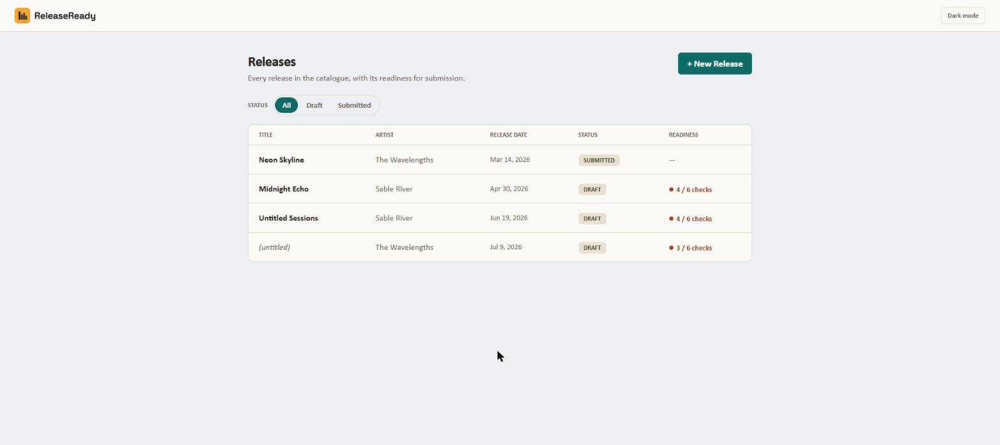
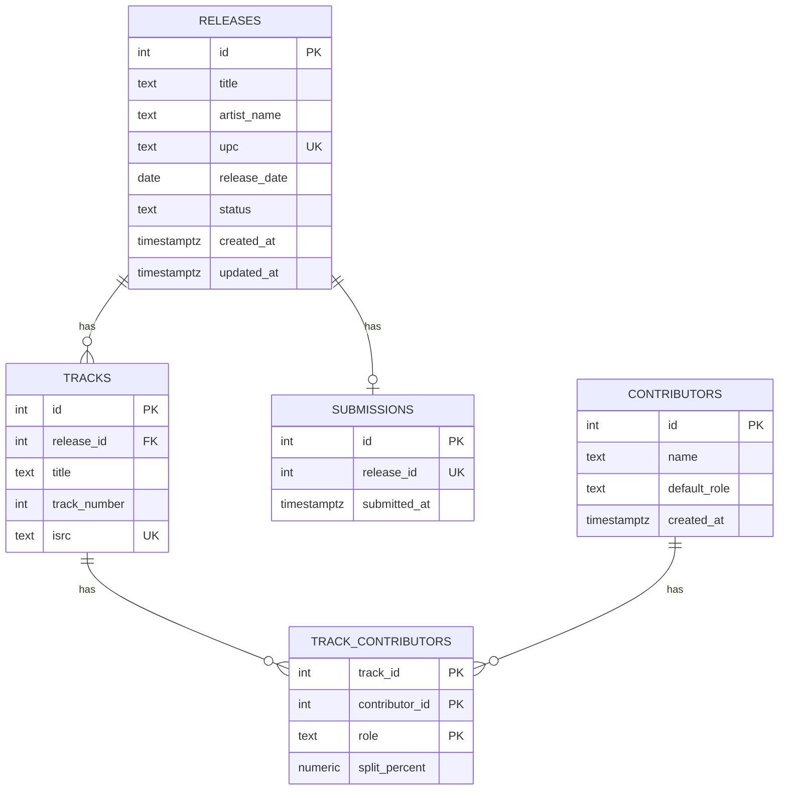
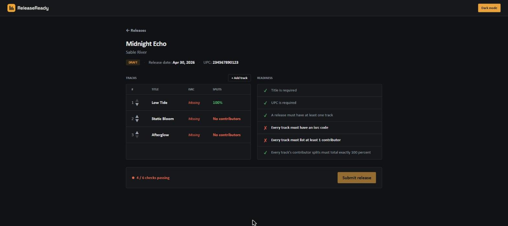
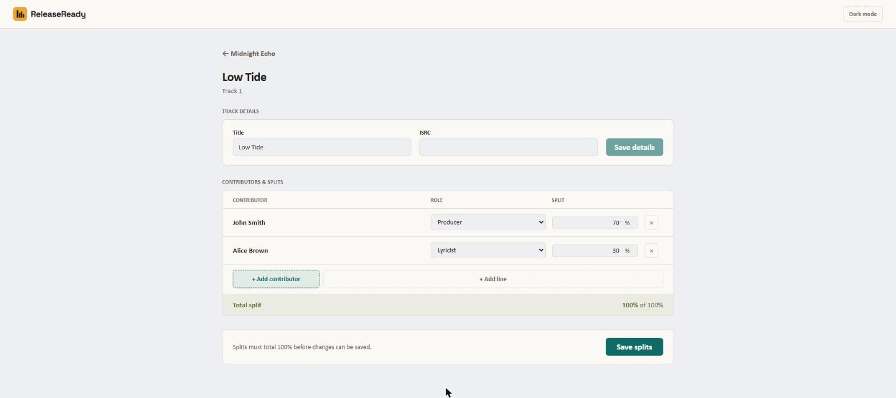

# ReleaseReady

[](https://github.com/Amit-Erez/ReleaseReady/actions/workflows/ci.yml)

**Live demo:** [release-ready-ae.vercel.app](https://release-ready-ae.vercel.app/) — API on Render's free tier, so the first load after a period of inactivity can take up to a minute while it spins back up; it's fast on every load after that.



ReleaseReady is a release-readiness tool for independent labels, built directly from my own four and a half years at CD Baby — the last of them in Operations QA, manually checking music-release metadata before it went out to streaming platforms.

Every release that reaches a platform passes through a distributor, and distributors reject or delay releases over metadata: a missing ISRC code, contributor splits that don't total 100 percent, incomplete credits. Small independent labels and self-releasing artists have no operations team catching this — they track releases in spreadsheets and find out something's wrong only when the distributor bounces it, which can cost them their release date. ReleaseReady is the pre-flight check I wish had existed: catalogue releases and tracks, manage contributor credits and splits, and run a readiness check before submission.

## Stack

- **Backend**: Node, Express, TypeScript, PostgreSQL (via `pg`, hand-written SQL), `node-pg-migrate`
- **Frontend**: React, TypeScript, Vite, React Router, React Hook Form + Zod, TanStack Query, Tailwind CSS
- **Shared**: Zod schemas shared between frontend and backend (`packages/shared`)
- **Testing**: Vitest, Supertest, React Testing Library

See [`docs/decisions.md`](docs/decisions.md) for the architecture decisions behind the project structure.

## Schema

Five tables: `releases`, `tracks`, `contributors`, `submissions`, plus `track_contributors` as the join table carrying the genuine many-to-many between tracks and contributors (each row's `role` and `split_percent` is real payload, not just a link). A release has zero-or-one `submissions` row, enforced by a real `UNIQUE` constraint on `submissions.release_id` — not just a modeling choice, the database itself rejects submitting the same release twice.



## Screenshots

**Readiness panel**, showing a mixed pass/fail state (dark mode):



**Split editor**, with the live-updating total:



## The submission transaction

When a release is submitted, the server re-checks readiness, inserts a `submissions` row, and flips the release's `status` to `submitted` — all inside one database transaction, committing together or rolling back together if either write fails.

It matters because it protects a real invariant: there must never be a submission row for a release that isn't marked submitted, or a submitted release with no record of its submission. A rollback integration test proves this directly — it forces a failure between the two writes and asserts that no submission row exists and the release's status is unchanged.

## Testing and CI

Backend: 11 Vitest tests — one per readiness rule plus an all-clear case (pure unit tests, no database), and three Supertest integration tests against a real test database covering a successful submission, a failed readiness check, and the rollback test above. Frontend: one React Testing Library component test covering the split editor's live total and save-gating behavior.

GitHub Actions runs the backend suite on every push and pull request to `main` — install, start a Postgres service container, migrate, test. Badge at the top of this README.

## Local setup

```
npm install
npm run build -w apps/api      # compiles the backend
npm run build -w apps/web      # builds the frontend
npm run migrate:up -w apps/api # applies all database migrations
npm run seed -w apps/api       # wipes and reseeds sample data (safe to rerun)
```

Requires a local PostgreSQL database and a `DATABASE_URL` set in `apps/api/.env` (gitignored, not committed).

## Known limitations

- Abandoning the "Add contributor" flow before assigning/saving the new person leaves a permanently orphaned `contributors` row — accepted, not solved.
- The live API runs on Render's free tier, which spins down after ~15 minutes idle; the first request after that can take up to a minute.
- Track reordering is up/down buttons only; the underlying endpoint supports drag-and-drop, but that UI wasn't built this pass.

## Phase 2 (deliberately not built)

Per the brief's own scoping: a contributor directory screen, release deletion or archival, search, sorting, pagination, a fuller submission-history view, delivery targets, platform-specific validation rules, additional endpoints, more component and integration tests, Docker Compose for local development, and CSV catalogue import.

---

For the full week-by-week build log — every endpoint, every real bug hit and fixed, and the reasoning behind the non-obvious decisions — see [`docs/progress-log.md`](docs/progress-log.md).
